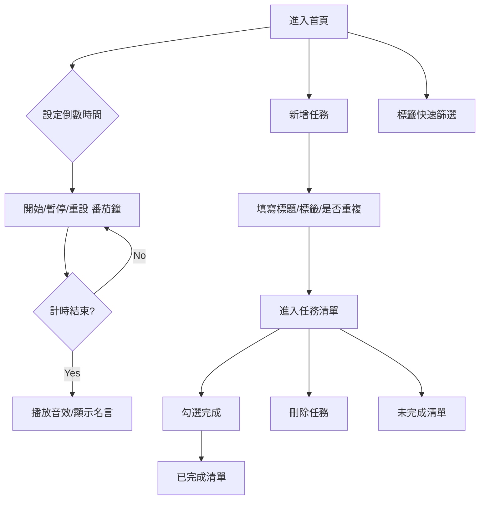

# DailyFocus

### 番茄鐘與任務管理 App

### 一、專案簡介

> 番茄鐘計時與任務管理的 Android 應用

### 二、核心功能

- 番茄鐘計時與自訂時長
- 任務新增、標籤、每日重複、完成/刪除
- 橫向標籤篩選
- 動畫/音效回饋
- 極簡沉浸式 Material 3 UI

### 三、技術架構

- Kotlin、Jetpack Compose、MVVM
- Room、StateFlow、Hilt
- 單元測試：MockK、Turbine、JUnit 5

### 四、UI/功能結構

1. 頂部 AppBar（右上+任務）
2. 番茄鐘設定與倒數
3. 開始/暫停/重設
4. 標籤篩選、任務清單（未完成/已完成）
5. 可愛吉祥物/動畫/音效提示

## App 主要畫面預覽

### 五、**任務流程圖**

### 六、測試分組

- Repository 互動（CRUD）
- Flow 狀態/事件（Turbine/JUnit 5）
